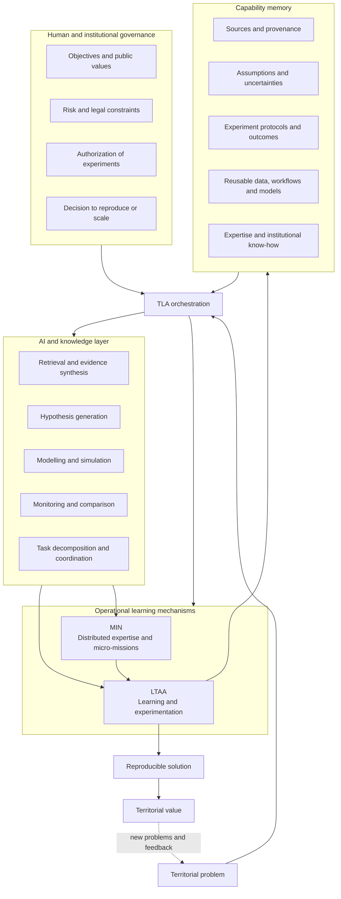

# TLA system architecture

## Purpose

TLA — Territorial Learning Architecture — is a socio-technical architecture for AI-augmented territorial problem solving. It is designed for situations in which the problem is cross-sectoral, information is incomplete, several actors hold partial knowledge, and uncertainty cannot be eliminated before action.

TLA does not assign public authority to an AI system. It structures how AI capabilities, human expertise, controlled experimentation and institutional decision rights interact over repeated learning cycles.

## System view

## Decision rights

TLA separates assistance from authority.

AI systems may retrieve information, synthesize evidence, identify inconsistencies, generate hypotheses, design candidate experiments, simulate scenarios, monitor results and coordinate bounded tasks.

Human institutions remain responsible for defining public objectives, determining acceptable risk, authorizing experiments, adjudicating value conflicts, and deciding whether a solution should be reproduced or scaled.

## Three operational objects

### 1. Uncertainty register

For each problem, TLA maintains an explicit set of uncertainties. These may concern data, causal mechanisms, stakeholder behaviour, implementation conditions, legal constraints or public-value trade-offs.

### 2. Experiment record

Each micro-experiment is documented before execution: hypothesis, scope, expected evidence, indicators, safeguards, stopping conditions and decision rights. Observed outcomes are then attached to the same record.

### 3. Capability object

Learning is not considered complete when a report is written. TLA seeks to convert validated learning into a reusable capability: a dataset, workflow, model, protocol, expert network, contractual arrangement, API, monitoring process or combination of these elements.

## Relationship between TLA, LTAA and MIN

**TLA** is the general architecture.

**LTAA** is the operational mechanism that organizes learning through uncertainty reduction and bounded experimentation.

**MIN** is the mechanism used to mobilize distributed expertise through structured micro-missions when relevant knowledge is not concentrated inside one institution.

The detailed institutional form of LTAA and MIN may vary between territories. TLA specifies their functional roles rather than imposing one administrative structure.
